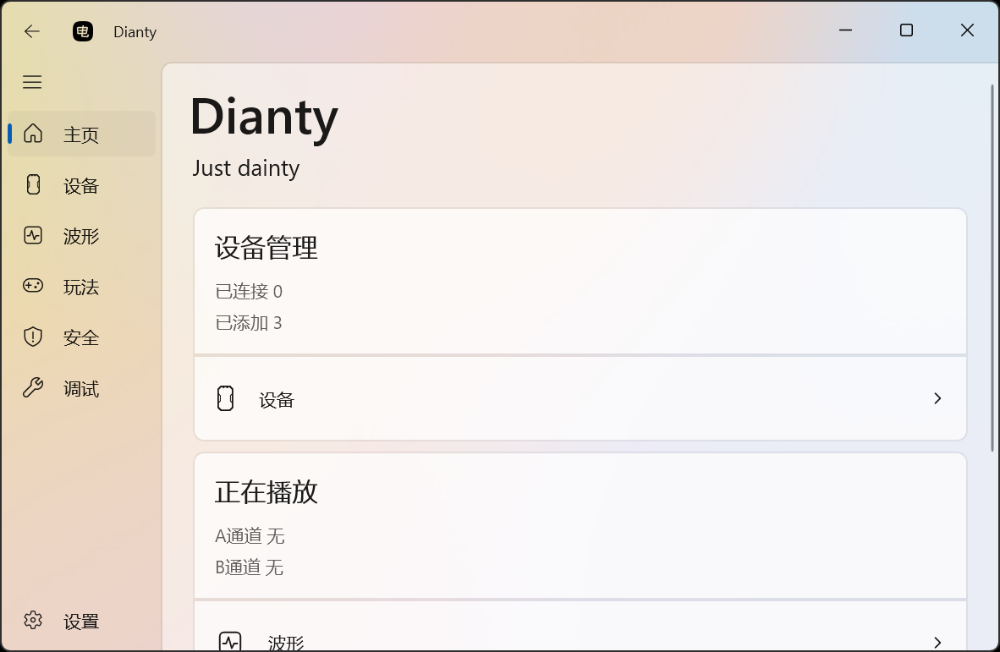
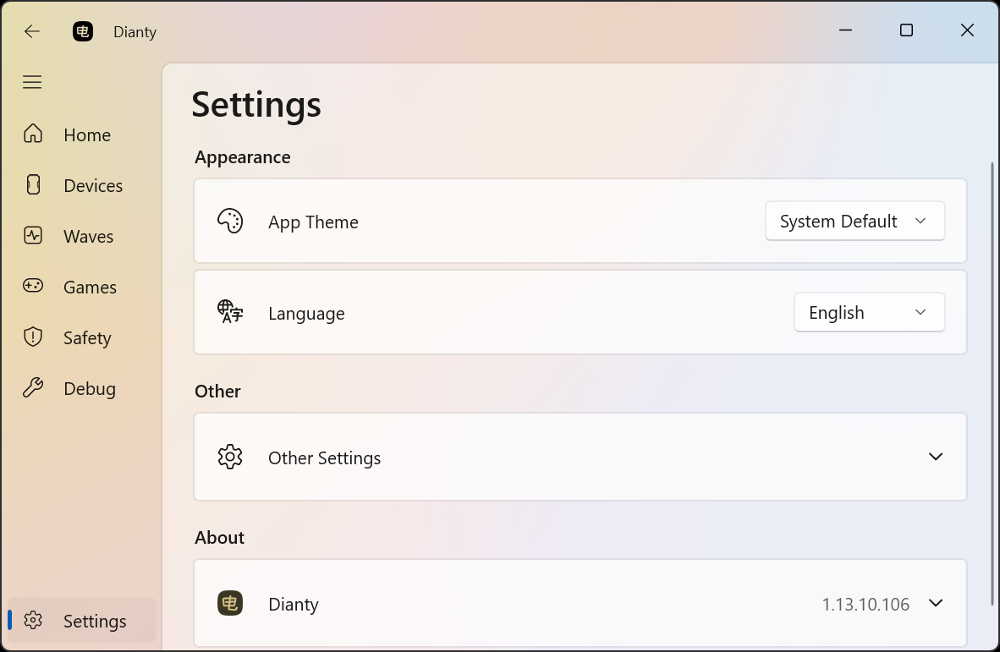
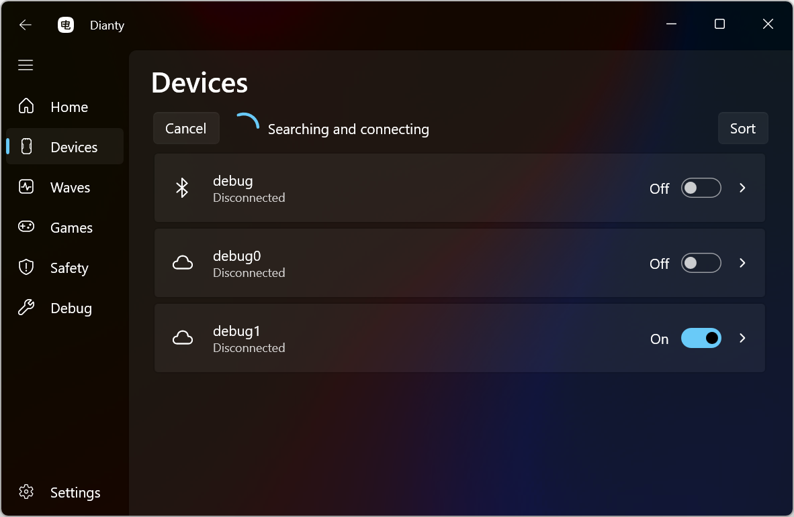
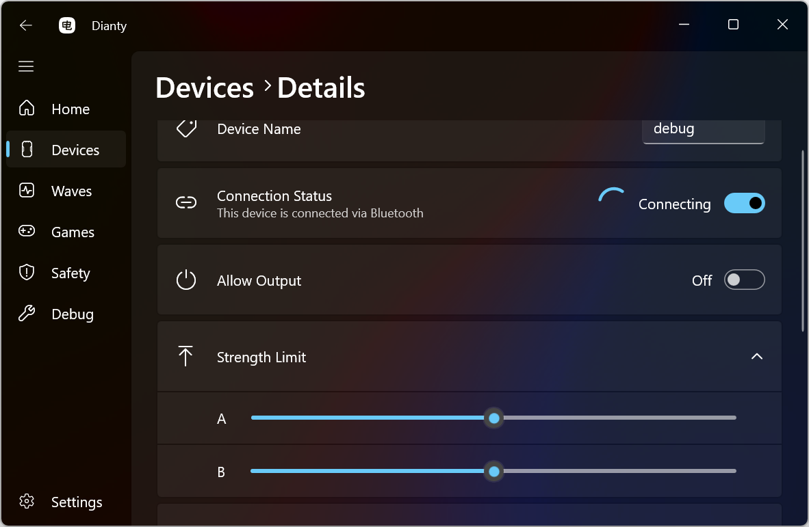
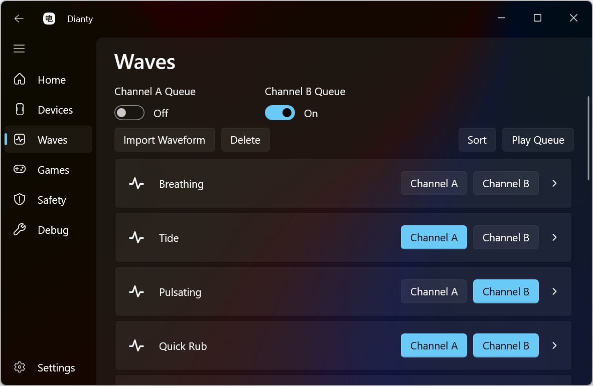
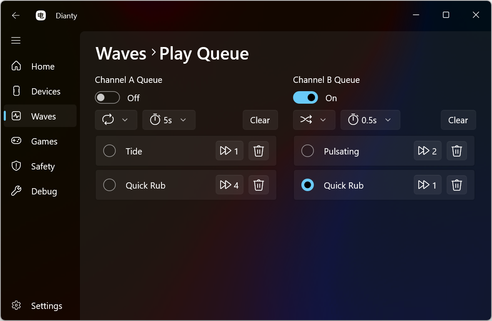

# Dianty

## App Interface Display













## Localizing the Interface with JSON Files

The app reads localization files from:

`<application directory>/Localization/Text/`

Each JSON file in this folder can provide a language option. The text shown in the language dropdown on the Settings page comes from the file’s `LanguageLabel` value. If `LanguageLabel` is empty or missing, the dropdown uses the file name instead.

For example, if `123.json` contains:

```json
{
  "LanguageLabel": "example",
  "Greeting": "Hello"
}
```

then `example` will appear in the language dropdown. If `LanguageLabel` is `""` or not present at the top level, the dropdown will show `123.json` instead.

### Loading and refreshing

Localization files are scanned when the app starts, and only at startup. A file is added to the language dropdown only if it can be parsed successfully. So if you add a new JSON file while the app is already running, restart the app to make the new language option available.

### Adding a language

A simple workflow is to take an existing localization JSON file, give it to an AI, and ask it to translate the values into the target language. Save the translated file under:

`<application directory>/Localization/Text/`

Then start the app and choose the language from the Settings page.

### Editing an existing language

If you need to change an existing JSON file, you can edit it directly. After saving your changes, reselect that language in the Settings page to apply the updated text.
